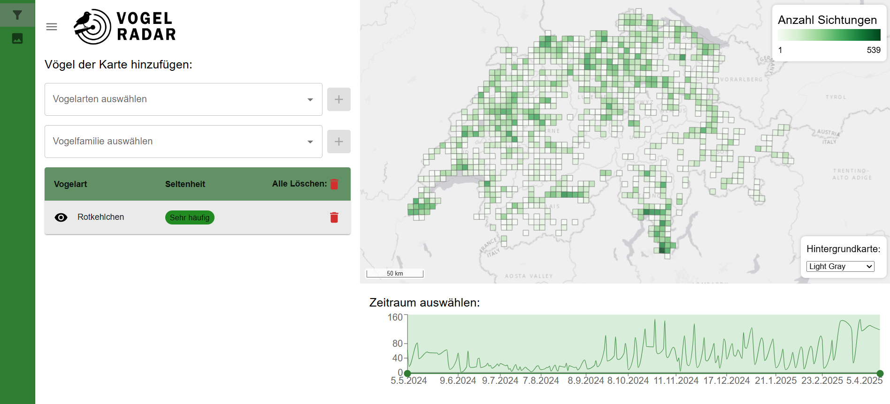
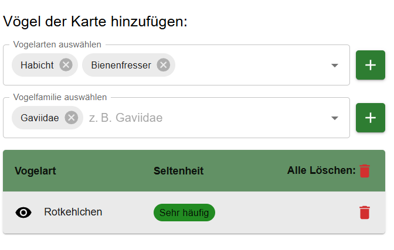
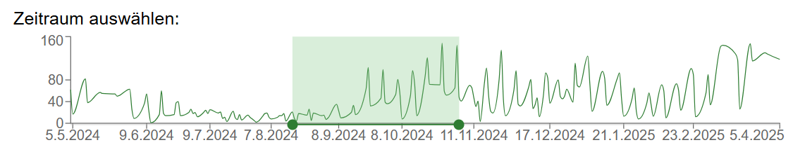
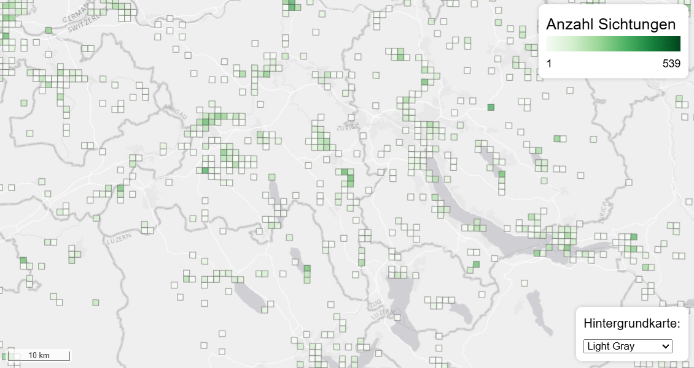
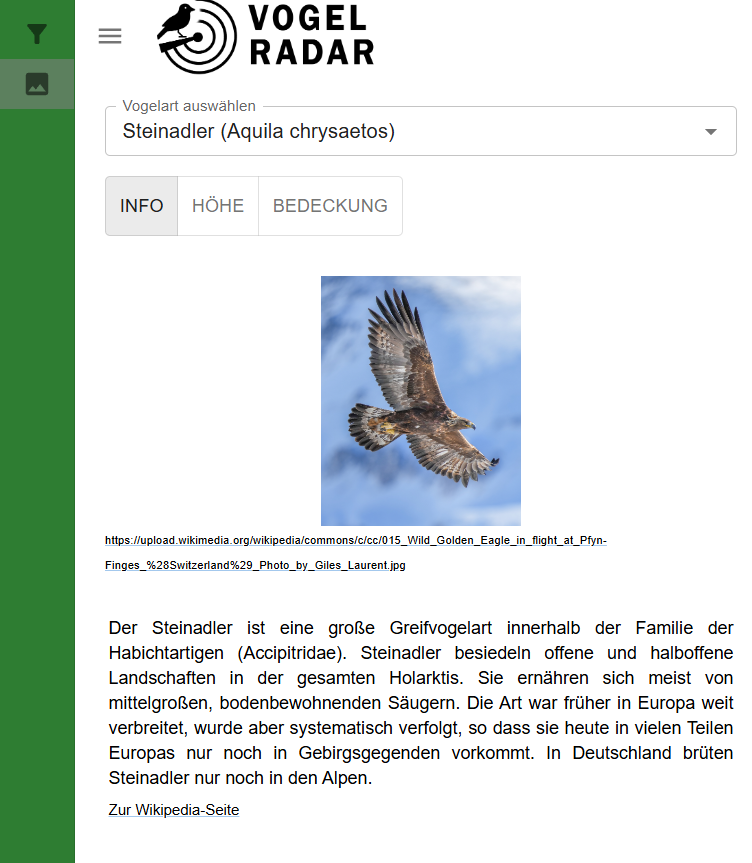
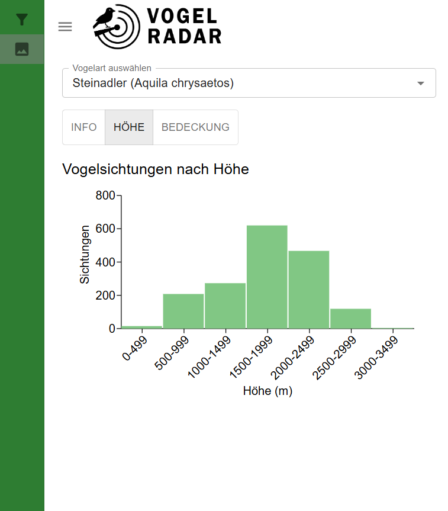
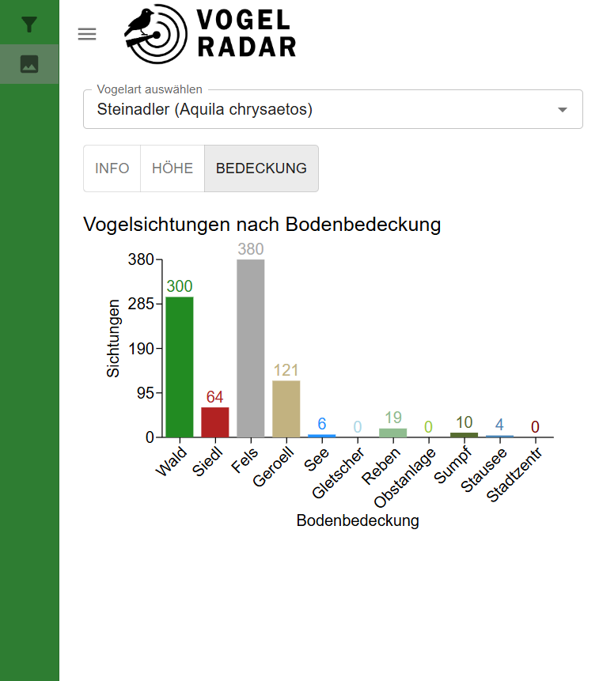

Willkommen bei **Vogelradar**, einer interaktiven Webanwendung zur Darstellung und Analyse von Vogelbeobachtungsdaten aus der Schweiz.  

In unserem Team haben wir eine Web-App entwickelt, die es Vogelliebhabern ermöglicht, sich über verschiedene Vogelarten und ihre Sichtungsgebiete zu informieren. Dabei legen wir besonderen Wert auf den Schutz seltener Arten: Die Standortdaten werden bewusst so dargestellt, dass keine genauen Koordinaten preisgegeben werden – um die Tiere nicht zu gefährden, aber dennoch wertvolle Informationen bereitzustellen.

---

## Datengrundlage
[Ornitho.ch](https://www.ornitho.ch) ist eine Online-Plattform zur Erfassung und Dokumentation von Vogelbeobachtungen. Die Daten stammen aus Crowdsourcing - also von einer grossen Gemeinschaft freiwilliger Vogelbeobachterinnen und -beobachter, die ihre Sichtungen laufend eintragen. Dadurch entsteht eine wertvolle, kontinuierlich wachsende Datengrundlage zur Vogelwelt in der Schweiz. Ornitho stellt zudem eine nicht öffentliche API bereit, die wir als Datengrundlage für unsere Anwendung genutzt haben. 

---

## Funktionalitäten

 
**Interaktive Karte, die Vogel-Sichtungen in einem Raster aggregiert darstellt.**

**Filtermöglichkeiten nach Vogelart und Vogelfamilie**

Alle Vögel welche sich in der Tabelle befinden werden in der Karte dargestellt. Vögel können mithilfe des Multiauswahl-Suchsfeld und des Plus Knopfes hinzugefügt werden. Dabei kann man einzelne Vogelarten oder ganze Vogelfamilien auswählen. Diese lassen sich natürlich mit dem Mülleimer wieder entfernen.

**Zeitraumauswahl**

Mithilfe des Sliders lässt sich der Zeitraum bestimmen für welchen man Informationen über Vogelvorkommen erhalten will. Ausserdem kann man anhand des Liniendiagramms erkennen wann mehr oder weniger Vögel gesichtet wurden.

**Karte**

Auf der Karte werden die Vogelsichtung in einem Raster dargestellt. Anhand der Farbintensität kann man erkennen wo viele und wo wenig gesichtet wurden. Wenn man sich auf einer niedrigen Zoomstufe befindet bekommt man mit einem 5km Raster eine grobe Übersicht der Vorkommen über die ganze Schweiz verteilt. Bei einer niedrigeren Zoomstufe bekommt man  mit einem 1km Raster genauere Positionsinformationen. Es kann ausserdem auch die Hintergrundkarte geändert werden.

**Vogelinfos**

Hier wird ein Bild und eine kurze Beschreibung des Vogels von Wikipedia dargestellt. Bei gösserem Interesse wird man über einen Link zu Wikipedia geleitet.
Ausserdem kann man sich Statistiken über die Anzahl Sichtungen nach Höhe und nach Bodenbedeckung anzeigen lassen.

  
  
  

## Verwendete Technologien & Methoden

| Komponente | Technologie / Methode                     |
| ---------- | ----------------------------------------- |
| Frontend   | React + OpenLayers                        |
| Backend    | FastAPI                                   |
| API        | Ornitho API (OAuth1)                      |
| Datenbank  | PostgreSQL + PostGIS                      |
| Analyse    | Raum-Zeit-Filter, Raritätsbewertung       |
| Deployment | Vercel (Frontend), lokale FastAPI-Instanz |

Weitere technische Details und Setup-Anleitung findest du im [README](https://github.com/jonasheinz/BirdApp/blob/main/README.md).

---

## Voraussetzungen

- Python 3.10+
- Node.js 18+
- PostgreSQL mit PostGIS
- GeoServer (optional)
- .env mit API-Zugangsdaten

## Quellen

- Hintergrundkarten:
  - Light Gray, [ArcGIS Online](https://server.arcgisonline.com/ArcGIS/rest/services/Canvas/World_Light_Gray_Base/MapServer/tile/{z}/{y}/{x}) 
  - [OpenStreetMap](https://tile.openstreetmap.org/{z}/{x}/{y}.png)
  - Satellite, [ArcGIS Online](https://server.arcgisonline.com/ArcGIS/rest/services/World_Imagery/MapServer/tile/{z}/{y}/{x})
