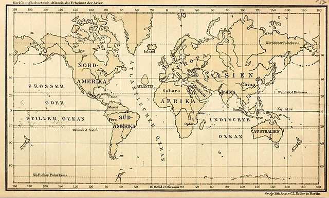

Willkommen bei **Vogelradar**, einer interaktiven Webanwendung zur Darstellung und Analyse von Vogelbeobachtungsdaten aus der Schweiz.  

In unserem Team haben wir eine Web-App entwickelt, die es Vogelliebhabern ermöglicht, sich über verschiedene Vogelarten und ihre Sichtungsgebiete zu informieren. Dabei legen wir besonderen Wert auf den Schutz seltener Arten: Die Standortdaten werden bewusst so dargestellt, dass keine genauen Koordinaten preisgegeben werden – um die Tiere nicht zu gefährden, aber dennoch wertvolle Informationen bereitzustellen.

[Demovideo ansehen](https://www.youtube.com/watch?v=dQw4w9WgXcQ) 

---

## Datengrundlage
[Ornitho.ch](https://www.ornitho.ch) ist eine Online-Plattform zur Erfassung und Dokumentation von Vogelbeobachtungen. Die Daten stammen aus Crowdsourcing - also von einer grossen Gemeinschaft freiwilliger Vogelbeobachterinnen und -beobachter, die ihre Sichtungen laufend eintragen. Dadurch entsteht eine wertvolle, kontinuierlich wachsende Datengrundlage zur Vogelwelt in der Schweiz. Ornitho stellt zudem eine nicht öffentliche API bereit, die wir als Datengrundlage für unsere Anwendung genutzt haben. 

---

## Funktionalitäten
 
- Interaktive Karte, die Vogel-Sichtungen in einem Raster aggregiert darstellt.
- Filtermöglichkeiten nach Vogelart und Vogelfamilie.
- Detailansicht zu einem Vogel mit Bild, Kurzbeschreibung und Statistiken nach Höhe und Bodenbedeckungsart.
- Ein Liniendiagramm visualisiert die Verteilung der Sichtungen über die einzelnen Monate. Über ein auswählbares Zeitfenster können gezielt nur die Daten eines bestimmten Zeitraums angezeigt werden.

---

## Verwendete Technologien & Methoden

| Komponente | Technologie / Methode                     |
| ---------- | ----------------------------------------- |
| Frontend   | React + OpenLayers                        |
| Backend    | FastAPI                                   |
| API        | Ornitho API (OAuth1)                      |
| Datenbank  | PostgreSQL + PostGIS                      |
| Analyse    | Raum-Zeit-Filter, Raritätsbewertung       |
| Deployment | Vercel (Frontend), lokale FastAPI-Instanz |

Weitere technische Details und Setup-Anleitung findest du im [README](https://github.com/jonasheinz/BirdApp/blob/main/README.md).

---

## Voraussetzungen

- Python 3.10+
- Node.js 18+
- PostgreSQL mit PostGIS
- GeoServer (optional)
- .env mit API-Zugangsdaten
